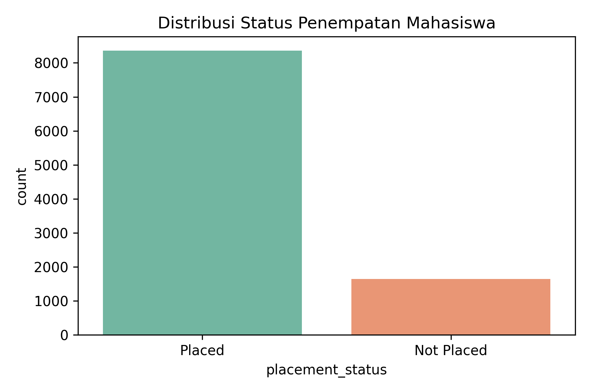
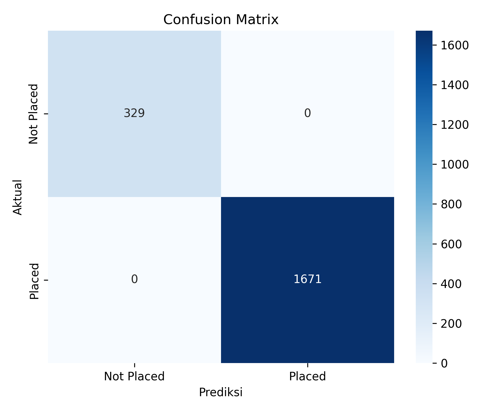
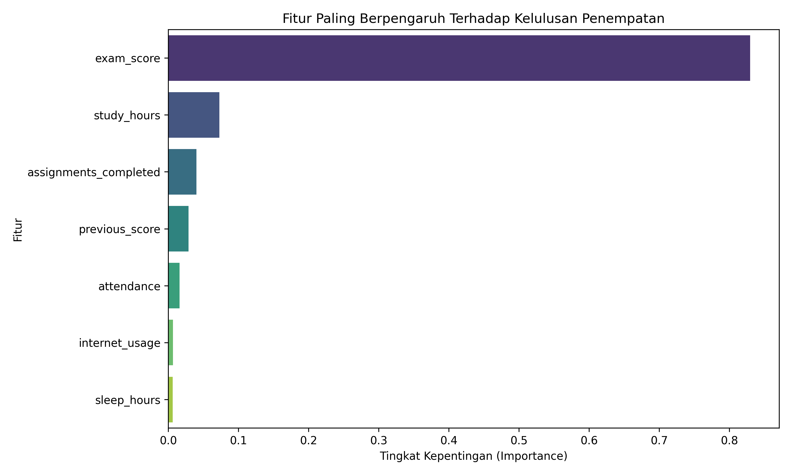

# Student Performance Prediction

Proyek machine learning untuk memprediksi status penempatan mahasiswa (`Placed` atau `Not Placed`) berdasarkan kebiasaan belajar, kehadiran, penggunaan internet, penyelesaian tugas, dan performa akademik sebelumnya.

Model yang digunakan adalah **Random Forest Classifier** dengan pipeline sederhana mulai dari exploratory data analysis (EDA), preprocessing, training, evaluasi, visualisasi, hingga export model.

## Ringkasan Project

- **Tujuan:** memprediksi apakah mahasiswa berpotensi mendapatkan penempatan kerja.
- **Dataset:** `10.000` baris data mahasiswa.
- **Target:** `placement_status`.
- **Algoritma:** Random Forest Classifier.
- **Akurasi pada data uji:** `100.00%`.
- **Output utama:** model tersimpan di `models/random_forest_model.pkl`.

## Struktur Folder

```text
Student Performance Prediction/
+-- data/
|   +-- student_dataset_10000_rows.csv
+-- models/
|   +-- random_forest_model.pkl
+-- notebooks/
|   +-- student_placement_modeling.ipynb
+-- reports/
|   +-- figures/
|       +-- confusion_matrix.png
|       +-- feature_importance.png
|       +-- target_distribution.png
+-- requirements.txt
+-- README.md
```

## Dataset

Dataset berada di folder:

```text
data/student_dataset_10000_rows.csv
```

Fitur yang digunakan:

| Kolom | Deskripsi |
| --- | --- |
| `study_hours` | Jumlah jam belajar mahasiswa |
| `attendance` | Persentase kehadiran |
| `sleep_hours` | Jumlah jam tidur |
| `internet_usage` | Durasi penggunaan internet |
| `assignments_completed` | Jumlah tugas yang diselesaikan |
| `previous_score` | Nilai akademik sebelumnya |
| `exam_score` | Nilai ujian |
| `placement_status` | Target prediksi: `Placed` atau `Not Placed` |

Distribusi target:

| Kelas | Jumlah Data |
| --- | ---: |
| `Placed` | 8.356 |
| `Not Placed` | 1.644 |

Dataset tidak memiliki missing value.

## Alur Pengerjaan

1. Import library dan persiapan folder output.
2. Load dataset dari folder `data/`.
3. Exploratory Data Analysis untuk memahami struktur data, missing value, dan distribusi target.
4. Encoding target `placement_status` menjadi nilai numerik.
5. Split data menjadi data latih 80% dan data uji 20%.
6. Training model menggunakan Random Forest Classifier.
7. Evaluasi model menggunakan akurasi, classification report, dan confusion matrix.
8. Analisis feature importance.
9. Export model ke file `.pkl`.

## Hasil Evaluasi

Model Random Forest menghasilkan akurasi:

```text
Akurasi Model: 100.00%
```

Classification report pada data uji:

| Kelas | Precision | Recall | F1-score | Support |
| --- | ---: | ---: | ---: | ---: |
| `Not Placed` | 1.00 | 1.00 | 1.00 | 329 |
| `Placed` | 1.00 | 1.00 | 1.00 | 1671 |
| **Accuracy** |  |  | **1.00** | **2000** |

Catatan: akurasi 100% perlu dianalisis lebih lanjut pada pengembangan berikutnya untuk memastikan tidak ada data leakage atau pola dataset yang terlalu mudah dipisahkan.

## Visualisasi

### Distribusi Target



### Confusion Matrix



### Feature Importance



## Cara Menjalankan Project

### 1. Clone atau buka folder project

```bash
cd "Student Performance Prediction"
```

### 2. Buat virtual environment

```bash
python -m venv .venv
```

Aktifkan virtual environment.

Windows:

```bash
.venv\Scripts\activate
```

macOS/Linux:

```bash
source .venv/bin/activate
```

### 3. Install dependency

```bash
pip install -r requirements.txt
```

### 4. Jalankan notebook

Buka notebook berikut menggunakan Jupyter Notebook atau VS Code:

```text
notebooks/student_placement_modeling.ipynb
```

Lalu jalankan seluruh cell secara berurutan.

## Menggunakan Model Tersimpan

Model hasil training sudah tersedia di:

```text
models/random_forest_model.pkl
```

Contoh penggunaan:

```python
import joblib
import pandas as pd

model = joblib.load("models/random_forest_model.pkl")

data_baru = pd.DataFrame({
    "study_hours": [7],
    "attendance": [85],
    "sleep_hours": [7],
    "internet_usage": [5],
    "assignments_completed": [12],
    "previous_score": [78],
    "exam_score": [88.5]
})

prediksi = model.predict(data_baru)
print(prediksi)
```

Output prediksi berupa label numerik:

- `0` = `Not Placed`
- `1` = `Placed`

## Teknologi yang Digunakan

- Python
- Pandas
- NumPy
- Matplotlib
- Seaborn
- Scikit-learn
- Joblib
- Jupyter Notebook

## Author

**Muhammad Dimas Alfathir**
